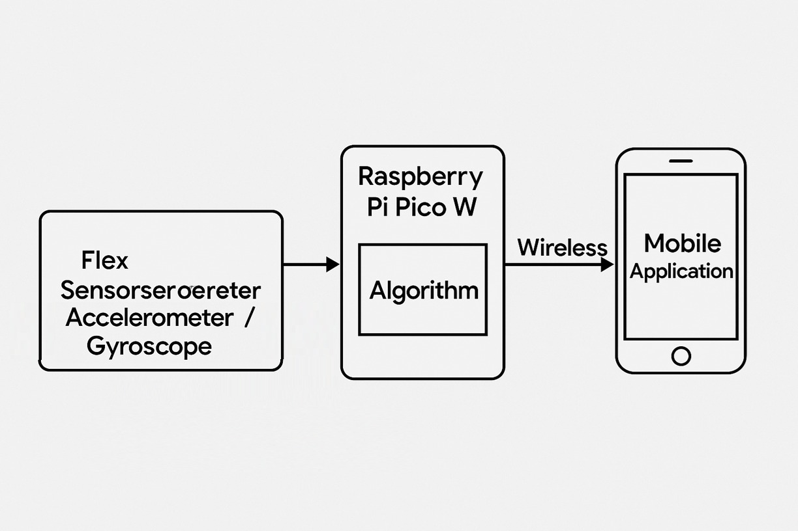

# Proyecto: HandSpeak

## Descripción del Proyecto

El sistema funciona a través de un guante electrónico, el cual detecta las posiciones de los dedos y la orientación de la mano utilizando sensores flexibles y un acelerómetro/giroscopio (MPU6050). Luego, un microcontrolador Raspberry Pi Pico W procesa estos datos mediante un algoritmo programado en C, que reconoce letras del alfabeto dactilológico. La información reconocida será enviada de forma inalámbrica a una aplicación móvil, donde se visualizarán los resultados en tiempo real.

A continuación se presenta el diagrama de bloques del proyecto:  
**

---

## Requisitos Funcionales

1. *Procesamiento de Señales Sensoriales*  
   El sistema debe adquirir y procesar en tiempo real los datos provenientes de sensores flex (uno por dedo) y del módulo MPU6050 (acelerómetro y giroscopio). Este debe contar con una rutina de calibración inicial para adaptar los umbrales del algoritmo de reconocimiento a las características físicas de cada usuario, garantizando mayor precisión en la interpretación de los gestos. Este procesamiento será implementado mediante un algoritmo programado en lenguaje C, ejecutado en la Raspberry Pi Pico W.

2. *Reconocimiento de Gestos*  
   El sistema debe ser capaz de distinguir entre múltiples configuraciones de los dedos y orientaciones de la mano, para reconocer un conjunto definido de letras del alfabeto en lengua de señas. El reconocimiento se realizará localmente en el microcontrolador sin intervención de servidores externos, garantizando independencia y rapidez en la ejecución.

3. *Comunicación Inalámbrica*  
   Una vez reconocida la letra correspondiente, el microcontrolador debe establecer una conexión inalámbrica mediante Wi-Fi utilizando el módulo integrado de la Raspberry Pi Pico W, enviando la letra a una aplicación móvil a través de un protocolo de comunicación.

4. *Gestión de Energía*  
   El guante debe estar alimentado por una batería recargable o fuente portátil, permitiendo una autonomía mínima de dos horas en funcionamiento continuo sin necesidad de recarga.

5. *Interfaz de Usuario*  
   La aplicación móvil debe contar con una interfaz amigable, clara y funcional, que permita visualizar el texto generado a partir de los datos enviados por el guante, mostrando la letra reconocida y concatenado con las anteriores para formar palabras; cuando se detecte la seña correspondiente a “espacio”, debe iniciar la construcción de una nueva palabra.

6. *Seguridad y Fiabilidad*  
   El sistema debe asegurar una comunicación confiable entre el guante y la aplicación móvil, incorporando validaciones que eviten datos falsos o malformados, así como mecanismos que detecten errores durante la transmisión. Cuando los datos de los sensores no coincidan con ningún gesto válido, el sistema debe mostrar un mensaje de error o el estado “gesto no reconocido” en la aplicación móvil.

---

## Requisitos No Funcionales

1. *Rendimiento*  
   La tasa de reconocimiento exitoso debe ser igual o superior al 80% en condiciones estándar de uso.

2. *Portabilidad*  
   El sistema embebido debe tener un diseño compacto y ligero, permitiendo su uso prolongado sin incomodidad.

3. *Mantenibilidad*  
   El código fuente debe estar documentado utilizando normas básicas de estilo y comentarios, facilitando su comprensión, actualización y depuración.

4. *Confiabilidad*  
   El sistema debe operar correctamente por un mínimo de 10 minutos continuos, sin fallos o reinicios inesperados.

5. *Compatibilidad*  
   La aplicación móvil debe ser compatible con al menos Android 10 o superior, garantizando su uso en la mayoría de los dispositivos móviles actuales.  
   La comunicación debe ser independiente de redes externas (sin requerir internet), utilizando únicamente la red local Wi-Fi punto a punto o hotspot.

6. *Usabilidad*  
   La interfaz de la aplicación debe ser intuitiva y accesible para usuarios sin experiencia técnica, con tipografía clara, navegación sencilla y retroalimentación inmediata ante cada entrada.

---

## Escenario de Pruebas

1. *Preparación del sistema*  
   - Se colocará el guante en la mano del usuario de prueba.  
   - La Raspberry Pi Pico W será encendida y ejecutará el algoritmo de calibración inicial, solicitando mantener una posición neutra durante algunos segundos.  
   - Se verificará que el módulo Wi-Fi esté conectado correctamente a la red local y que la app móvil esté enlazada al guante.

2. *Prueba del reconocimiento de letras*  
   - El usuario realizará secuencialmente al menos 5 gestos previamente definidos (uno por cada letra del alfabeto reconocido).  
   - Se validará que:
     - La letra reconocida coincida con el gesto realizado.  
     - La letra aparezca en la interfaz de la aplicación en tiempo real.  
     - La letra se concatene con las anteriores para formar palabras.

3. *Prueba del gesto de espacio*  
   - El usuario realizará la seña específica definida para indicar un espacio entre palabras.  
   - Se comprobará que:
     - Se separen las letras reconocidas en la aplicación iniciando una nueva palabra.  
     - La palabra anterior quede visible como texto ya generado.

4. *Prueba de error o “gesto no reconocido”*  
   - El usuario realizará un gesto aleatorio que no forme parte del conjunto entrenado.  
   - Se verificará que la aplicación muestre el mensaje “gesto no reconocido” o un estado similar, sin alterar la palabra en curso.

5. *Prueba de transmisión de datos*  
   - Durante las pruebas anteriores, se observará que:
     - No existan retardos notables en la comunicación.  
     - No se envíen caracteres malformados o duplicados.

---

## Presupuesto

| Componente              | Costo     |
|-------------------------|-----------|
| Raspberry Pi Pico W     | $47.000   |
| Sensor Flex x5          | $250.000  |
| Par de guantes          | $20.000   |
| MPU6050                 | $14.000   |
| Protoboard              | $10.000   |
| Cables dupont           | $6.000    |
| *Total*               | *$347.000* |

El total de los recursos necesarios para el proyecto será dividido de manera equitativa entre los cuatro miembros del equipo.  
Cada integrante contribuirá con un total de *$86.750*, garantizando que el financiamiento del proyecto se realice de manera justa y equilibrada.
