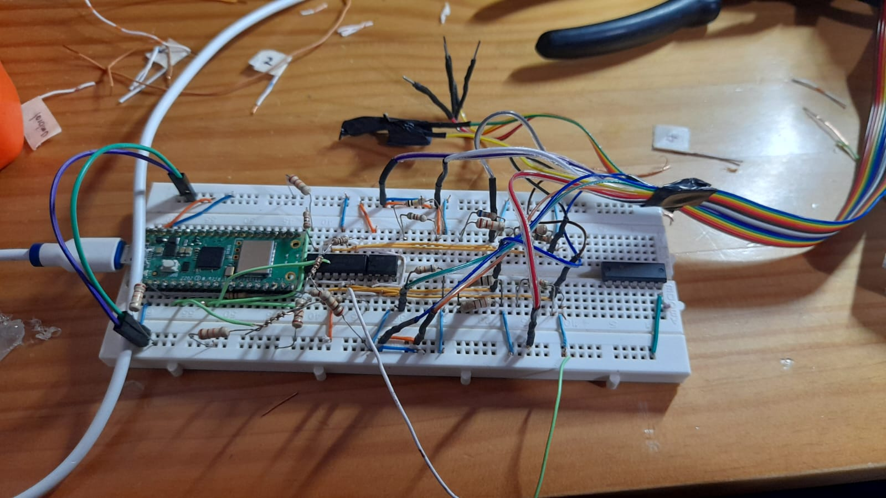
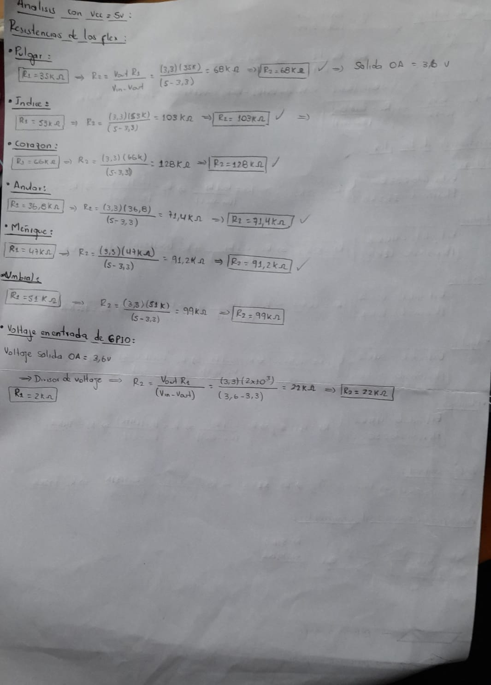

# HandSpeak
##Introducción

---

Se comenzo con la verificacion de los sensores flex y su debido funcionamiento.

  

---

Se realizo la proteccion de los sensores flex para evitar daños en estos a la hora de acoplarlos en el guante.

---

se inicio con la creacion del guante, comenzado con el debido aclope de los sensores flex a un guante.

Con este guante se presentaron los siguientes problemas:
- Guante demasiado rigido
- Al guante ser muy rigido cuando se intentaba flexionar los sensores se despegaban.
- A la hora de ponerse el guante era muy ancho para las manos de cualquiera de nosotros.
---

Se inicio la caracterizacion de los sensores a traves de divisores de voltaje y circuitos integrados en forma de comparadores(LM324 y LM358)

Este circuito se alimento con 3.3V sacados directamente de la Raspberry pi pico W, se establece un umbral de 2.2V para comparar con respecto a los 3.3V de la alimentacion.
Con este montaje se presentaron estos problemas:

- A la salida del comparador nos entregaba un voltaje de 2V o menor a 2V esto provocaba que las entradas GPIO de nuestro MCU no detectara correctamente la entrada como un alto o un bajo(se podia confundir por ruido).
- Al implementar el trimmer para el umbral, este a veces no era muy exacto lo cual generaba errores en la comparacion.

---
#### UPDATES
---

- Para corregir los anteriores problemas se opto por dejar el divisor de voltaje del umbral de comparacion fijo(sin trimmer) en 3.3V.
- Se cambio la alimentacion del circuito a 5V,haciendo una recalibracion de los divisores de voltaje de cada sensores flex.

- Se realizo la actualizacion de un nuevo guanto mas ergonomico el cual nos permitio una mejor lectura de los sensores Flex

- Se adacto el nuevo guante con el nuevo circuito de protoboard pero se encontro el problema de la protoboard, ya que esta trae las pistas muy anchas y las resistencias quedaban con mal contacto, generando valores erroneos en los divisores.

- Se opto como ultimo circuito un montaje en Baquela universal para evitar errores de contactos y de esta manera tener un circuito mas compacto.
- Se agrego la IMU(GY91) al guante para iniciar las pruebas con movimiento, obteniendo buenos resultados con esta referencia de IMU.

El siguiente paso fue la implementacion del bluetooth como dispositivo de comunicación y de la creacion de la aplicación para mostrar las letras en lenguaje de señas a traves del celular.

