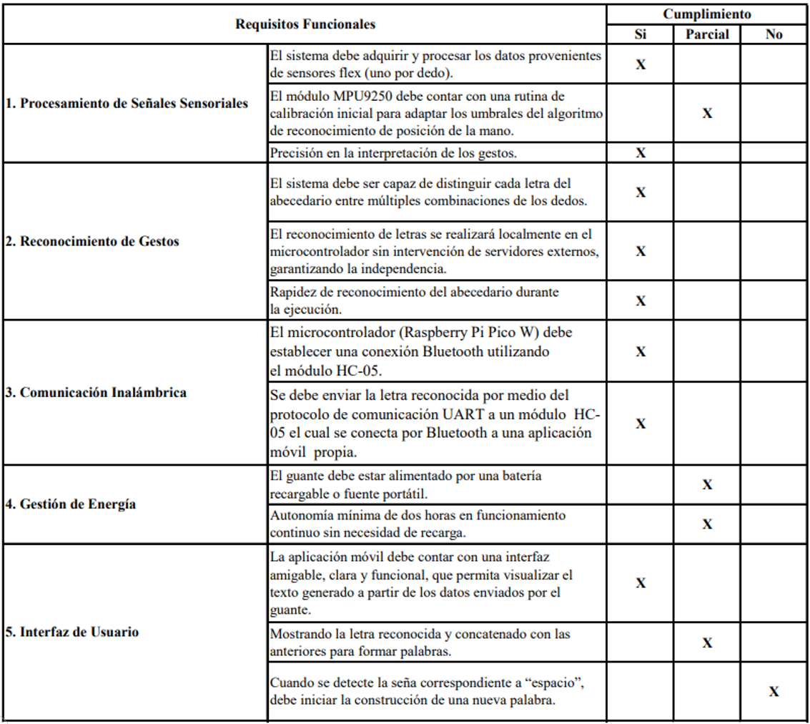
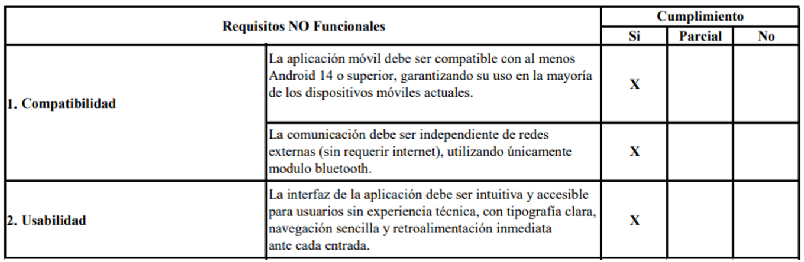

# HandSpeak
## Introducción

Actualmente, la inclusión y la accesibilidad son pilares fundamentales en el desarrollo de tecnologías que buscan mejorar la calidad de vida de las personas. Uno de los retos más significativos en este ámbito es la comunicación con personas con discapacidad auditiva que utilizan el lenguaje de señas como principal medio de expresión. El proyecto HandSpeak surge como una solución tecnológica que busca facilitar la interpretación de señas, permitiendo una comunicación más fluida e inclusiva entre personas sordas y oyentes.

HandSpeak consiste en el diseño e implementación de un guante inteligente capaz de reconocer letras del alfabeto en lengua de señas mediante sensores flex en los dedos y un módulo inercial (IMU) que detecta los movimientos de la mano. La información capturada es procesada por una Raspberry Pi Pico y transmitida vía Bluetooth a una aplicación móvil que interpreta y reproduce la letra detectada.

Este sistema busca no solo mejorar la interacción cotidiana de las personas sordas, sino también aportar a la educación, la accesibilidad digital y la construcción de entornos más inclusivos, consolidándose como una herramienta de apoyo en la eliminación de barreras comunicativas.

---
## Diseño del sistema de detección de flexión de dedos
Como idea inicial para la detección de señas, se planteó el uso de sensores flex G2 de 2.2 pulgadas, uno por cada dedo. El objetivo era establecer un valor estándar de resistencia para cada sensor, permitiendo una interpretación uniforme de las posiciones de los dedos. Sin embargo, durante las pruebas iniciales se observó que los sensores no presentaban valores de resistencia iguales en condiciones similares, lo que evidenció la necesidad de una calibración individual.

Por ejemplo, el primer sensor presentaba una resistencia de 33 kΩ cuando estaba estirado y de 37.5 kΩ cuando se encontraba doblado. En cambio, el segundo sensor registraba 44 kΩ estirado y 68 kΩ doblado. Esta variabilidad entre sensores obligó a implementar una etapa de acondicionamiento de señal personalizada para cada uno, basada en un divisor de voltaje alimentado a 3.3 V. La resistencia fija del divisor (R₁) se seleccionó como el valor medio entre las resistencias mínima y máxima medidas para cada sensor, permitiendo así generar una tensión de referencia representativa del estado de cada dedo.

La salida del divisor de voltaje fue conectada a un comparador implementado con amplificadores operacionales. Se utilizaron un LM324 (con cuatro amplificadores) y un LM358 (utilizando uno de sus dos amplificadores), lo que permitió procesar las señales de los cinco sensores. Cada comparador recibió también una tensión de referencia de 3.3 V, generada mediante otro divisor de voltaje, ya que la alimentación general del sistema era de 5 V. De este modo, cuando el sensor flex estaba estirado, la tensión de salida del divisor era mayor que 3.3 V, provocando que el comparador generara una salida de aproximadamente el 70 % de la tensión de alimentación (≈3.6 V). En cambio, cuando el dedo se doblaba, la resistencia del sensor aumentaba, reduciendo la tensión en el divisor y provocando que el comparador entregara una salida cercana a 0 V (nivel bajo o tierra).

Inicialmente, se intentó conectar directamente las salidas de los comparadores a los pines GPIO de la Raspberry Pi Pico (RP2040); sin embargo, esto ocasionaba lecturas erróneas de las letras detectadas por el guante. Tras revisar la documentación técnica de la RP2040, se identificó que el voltaje máximo admitido en sus entradas GPIO es de 3.3 V. Por lo tanto, fue necesario incorporar un segundo divisor de voltaje en cada línea de salida antes de ingresar a la RP2040, asegurando así la integridad de las señales digitales y el correcto funcionamiento del sistema de lectura. A contnuación se presentan fotografías evidenciando el proceso descrito.

  
   
  <em>Figura 1. Esquema del sistema de comparación de voltaje utilizando un amplificador operacional LM324. El voltaje de entrada varía según la resistencia del sensor flex (dependiente de la posición del dedo) y se compara con una referencia de 3.3 V. La salida del comparador pasa por un divisor de voltaje adicional para adecuarse al nivel máximo permitido por las entradas GPIO de la Raspberry Pi Pico (3.3 V).</em>

---
## Procedimiento de montaje del guante
Se comenzó con la verificacion de los sensores flex y su debido funcionamiento.

  
   
  <em>Figura 2. Verificación de sensores flex.</em>

Se realizó la proteccion de los sensores flex para evitar daños en estos a la hora de acoplarlos en el guante.

  
   
  <em>Figura 3. Protección de los sensores con termoencogible.</em>

Se inició con la creacion del guante, comenzado con el debido aclope de los sensores flex a un guante.

  
   
  <em>Figura 4. Protección de los sensores con termoencogible.</em>

Con este guante se presentaron los siguientes problemas:
- Guante demasiado rigido
- Al guante ser muy rigido cuando se intentaba flexionar los sensores se despegaban.
- A la hora de ponerse el guante era muy ancho para las manos de cualquiera de nosotros.
---

Para interpretar correctamente las variaciones de resistencia en los sensores flex instalados en los dedos del guante, se implementó una etapa de caracterización basada en comparadores de voltaje utilizando amplificadores operacionales LM324 y LM358.

  
   
  <em>Figura 5. Caracterización de los sensores mediante amplificadores operacionales comparadores (LM324 y LM358).</em>

Inicialmente se realizaron los siguientes cálculos:

  
   
  <em>Figura 6. Primeros cálculos realizados.</em>

Este circuito fue alimentado con un voltaje de 3.3 V proveniente directamente de la Raspberry Pi Pico W. Se estableció un umbral de referencia de 2.2 V para realizar la comparación con respecto a los 3.3 V de la alimentación.

Durante la implementación de este montaje se presentaron los siguientes inconvenientes:
- La salida del comparador entregaba un voltaje igual o inferior a 2 V, lo que provocaba que las entradas GPIO del microcontrolador no reconocieran correctamente los niveles lógicos. Esto generaba ambigüedad en la detección del estado alto o bajo, especialmente en presencia de ruido eléctrico.
- Al utilizar un trimmer para ajustar el umbral de comparación, se observó una falta de precisión en ciertos casos, lo cual derivaba en errores en el proceso de comparación.

---

## Resistencias de los sensores flex (Cálculos finales para 5V)
- Para corregir los problemas mencionados previamente, se optó por fijar el divisor de voltaje correspondiente al umbral de comparación en 3.3 V, eliminando el uso del trimmer para evitar errores de ajuste.

- Además, se cambió la alimentación del circuito a 5 V, lo que requirió una recalibración de los divisores de voltaje asociados a cada sensor flex, a fin de garantizar lecturas correctas y compatibles con el nuevo nivel de referencia.
### Pulgar (Se realizó esto de igual forma para cada uno de los demás dedos)

- **Extendido:** 33 kΩ  
- **Flexionado:** 37.5 kΩ

Se seleccionó una resistencia media para el divisor de voltaje:

$$
R_1 = 35\,k\Omega
$$

Para calcular \( R_2 \), se utilizó la fórmula del divisor de voltaje:

$$
R_2 = \frac{V_\text{out} \cdot R_1}{V_\text{in} - V_\text{out}}
$$

Sustituyendo los valores:

$$
R_2 = \frac{2.2 \cdot 35\,k\Omega}{3.3 - 2.2}
= \frac{77\,k\Omega}{1.1} = 70\,k\Omega
$$

**Resultado:**

$$
\boxed{R_2 = 70\,k\Omega}
$$

---

Del mismo modo, se calcularon los valores para los demás dedos, obteniendo:

### Índice
$$
\boxed{R_2 = 103\,k\Omega}
$$

### Corazón
$$
\boxed{R_2 = 128\,k\Omega}
$$

### Anular
$$
\boxed{R_2 = 71.4\,k\Omega}
$$

### Meñique
$$
\boxed{R_2 = 91.2\,k\Omega}
$$

### Divisor de voltaje para el comparador (umbral de 3.3 V)
$$
\boxed{R_2 = 99\,k\Omega}
$$

### Divisor de voltaje para la entrada GPIO (máximo 3.3 V)
$$
\boxed{R_2 = 22\,k\Omega}
$$

---
#### Mejoras en el diseño físico
---

- Se realizó la actualización a un nuevo guante con un diseño más ergonómico, lo cual permitió una mejor sujeción de los sensores flex y, en consecuencia, una lectura más precisa y estable de sus valores de resistencia.

  
   
  <em>Figura 7. Guante versión 2.0.</em>

- Se adaptó el nuevo guante al circuito en protoboard, sin embargo, se identificó un problema relacionado con el diseño físico de la protoboard: las pistas internas eran demasiado anchas, lo que provocaba un contacto deficiente con las resistencias. Esta situación generaba lecturas erróneas en los divisores de voltaje, afectando la precisión del sistema de detección.

  
   
  <em>Figura 8. Montaje del circuito sin IMU.</em>

- Se optó finalmente por realizar el montaje del circuito sobre una baquela universal, con el objetivo de evitar errores de contacto frecuentes en la protoboard y lograr un diseño más compacto, robusto y confiable.

- Se incorporó una IMU GY-91 al guante, permitiendo iniciar las pruebas con reconocimiento de movimiento. Esta adición fue muy importante para diferenciar letras que comparten el mismo patrón de posición de los dedos pero difieren en su dinámica. Por ejemplo, las letras "I" y "J" presentan configuraciones similares en cuanto a dedos alzados y retraídos; sin embargo, gracias a la IMU fue posible distinguir la letra "J" mediante la detección de movimiento, mejorando así la precisión del reconocimiento.

  
   
  <em>Figura 9. Montaje en baquela universal.</em>

El siguiente paso en el desarrollo fue la implementación de un módulo Bluetooth como medio de comunicación entre el guante y un dispositivo externo. Paralelamente, se desarrolló una aplicación móvil encargada de recibir y visualizar las letras detectadas por el sistema. Esta aplicación permite interpretar las señas realizadas por el usuario y mostrarlas en la pantalla del celular.

  
   
  <em>Figura 10. Circuito con módulo Bluetooth.</em>

  
   
  <em>Figura 11. Aplicación creada.</em>

Inicialmente se utilizó un módulo Bluetooth adquirido bajo la referencia HC-05. Sin embargo, durante las pruebas se detectaron inconsistencias en su funcionamiento que sugerían que el módulo no correspondía exactamente a dicha referencia, a pesar de haber sido adquirido como tal. Esta situación generó dificultades en el proceso de comunicación, lo que motivó una verificación más detallada.

  
   
  <em>Figura 12. Módulo Bluetooth adquirido como HC-05, pero con comportamiento inconsistente respecto a dicha referencia.</em>

Con la implementación de este módulo Bluetooth y la creación de la aplicación se presentaron los siguientes problemas:

  
   
  <em>Figura 13. Error al conectar la aplicación creada por Bluetooth.</em>

- La aplicación móvil no lograba establecer comunicación con el módulo Bluetooth, presentando un error de socket, lo que indicaba que no se estaba concretando una conexión efectiva entre el dispositivo móvil y el módulo.

Para diagnosticar el origen del problema, fue necesario utilizar la aplicación Serial Bluetooth Terminal, disponible en la Google Play Store. Esta herramienta permitió verificar si el módulo Bluetooth instalado estaba efectivamente transmitiendo los datos esperados, o si el inconveniente se encontraba del lado de la aplicación móvil. Gracias a esta prueba se pudo aislar el problema y determinar con mayor precisión la causa del fallo en la comunicación.

 

  
   
  <em>Figura 14. Aplicacion Serial Bluetooth Terminal (SBT).</em>

Contexto sobre la aplicación Serial Bluetooth Terminal:
La aplicación Serial Bluetooth Terminal fue utilizada como herramienta de diagnóstico para verificar la comunicación entre la Raspberry Pi Pico y el dispositivo móvil a través del módulo Bluetooth. Esta aplicación permite establecer una conexión mediante el puerto serial con módulos Bluetooth clásicos y BLE (Bluetooth Low Energy), ofreciendo así compatibilidad con una amplia gama de dispositivos.

En este caso, permitió visualizar los datos enviados desde la Raspberry Pi Pico a través del módulo Bluetooth. Su uso fue importante para confirmar que el módulo estaba transmitiendo correctamente y descartar errores en la lógica de la aplicación móvil desarrollada para el proyecto.

  
   
  <em>Figura 15. Reconocimiento de dispositivos Bluetooth Classic.</em>

 

  
   
  <em>Figura 16. Reconocimiento de dispositivos Bluetooth LE.</em>

-Ahora sabiendo un poco mas de la aplicacion se procedió a verificar que si conectara el Bluetooth y se enviara correctamente la informaciónn desde la Rasberry Pi Pico a la aplicación. 

  
   
  <em>Figura 17. Comunicación entre Raspberry Pi Pico y SBT.</em>

Al realizar esta prueba con Serial Bluetooth Terminal, se pudo constatar que el módulo Bluetooth sí estaba transmitiendo correctamente los datos, y que el código ejecutado en la Raspberry Pi Pico funcionaba de forma adecuada. Con esto se descartaron fallas en el hardware y en la lógica de transmisión del microcontrolador.

Posteriormente, se procedió a revisar si el problema residía en la aplicación móvil. Se comprobó que la aplicación desarrollada estaba configurada correctamente para comunicarse con un módulo Bluetooth clásico, específicamente con la referencia HC-05, según su hoja de datos. Sin embargo, al analizar más detenidamente la información mostrada por Serial Bluetooth Terminal, se identificó que el módulo adquirido no correspondía a la referencia HC-05, ya que aparecía como un dispositivo Bluetooth Low Energy (BLE) al momento de enlazarse.

Al conocer esta diferencia, se comprendió que la aplicación móvil —diseñada para trabajar con Bluetooth clásico y con los permisos/protocolos correspondientes— no podía establecer una conexión con un módulo BLE, lo cual generaba el error de socket previamente observado.

Para solucionar el problema, se reemplazó el módulo por uno que realmente correspondiera a la referencia HC-05. Una vez hecho este cambio, la aplicación pudo establecer correctamente la conexión con la Raspberry Pi Pico y recibir los datos transmitidos desde el guante.

  
   
  <em>Figura 18. Módulo Bluetooth HC-05.</em>

  
   
  <em>Figura 19. Aplicación en funcionamiento.</em>

Gracias a la solución implementada respecto al módulo Bluetooth, se logró establecer una comunicación estable entre la Raspberry Pi Pico y la aplicación móvil. Como resultado, fue posible mostrar correctamente todas las letras del abecedario en lenguaje de señas a través de la interfaz de la aplicación, permitiendo una interpretación fluida y precisa de los gestos realizados con el guante.

## Diagrama de Bloques

Los sensores flex se conectaron a los pines GPIO de la Raspberry Pi Pico a través de los divisores de voltaje previamente descritos. Esta etapa de acondicionamiento de señal permitió convertir las variaciones de resistencia generadas por la flexión de los dedos en niveles lógicos compatibles (3.3 V), facilitando así la detección binaria del estado de cada dedo (flexionado o extendido).

Adicionalmente, se integró al sistema una unidad inercial GY-91, que incorpora un acelerómetro y giroscopio MPU9250. Para la lectura de datos provenientes de esta IMU, se implementó una estrategia combinada de polling + interrupciones.

La comunicación entre la IMU y la Raspberry Pi Pico se estableció mediante el protocolo I²C, utilizando los pines GPIO 26 (SDA) y GPIO 27 (SCL). Por su parte, el módulo Bluetooth HC-05 fue conectado mediante el protocolo UART, usando los pines GPIO 16 (TX) y GPIO 17 (RX), lo que permitió transmitir de manera inalámbrica las letras detectadas hacia un dispositivo móvil Android que ejecutaba la aplicación desarrollada para el proyecto.

  
   
  <em>Figura 20. Diagrama de bloques del proyecto.</em>

## Diagrama de Flujo

El proceso comienza con la lectura del estado de cada dedo a través de los pines GPIO de la Raspberry Pi Pico, donde se detecta si cada uno de ellos está flexionado o extendido, según la información entregada por los sensores flex. Posteriormente, se realiza la detección de movimiento utilizando la IMU MPU9250, conectada por el protocolo I²C. Esta unidad inercial proporciona datos del acelerómetro, que son analizados para determinar si existe un movimiento significativo en la mano del usuario.

Una vez recopilados los datos de posición de los dedos y del movimiento de la mano, el sistema verifica si existe una letra asociada a dicho patrón combinado. Si no se reconoce ninguna letra válida, el sistema descarta la entrada. En cambio, si el patrón corresponde a una letra del alfabeto en lengua de señas, esta se transmite por UART al módulo HC-05, que la envía vía Bluetooth a un dispositivo móvil Android.

Antes de realizar el envío, el sistema también verifica si la letra detectada es diferente a la última que fue enviada. Esta verificación se realiza para evitar repeticiones innecesarias en caso de que el usuario mantenga la misma posición de los dedos. Si la letra es nueva, se guarda como la última enviada y se transmite; si es la misma, el sistema simplemente continúa con la siguiente iteración del ciclo.

  
   
  <em>Figura 21. Diagrama de flujo del proyecto.</em>

## Requisitos Funcionales

  
   
    <em>Figura 22. Requisitos funcionales del sistema.</em>

## Requisitos NO Funcionales

  
   
    <em>Figura 23. Requisitos NO funcionales del sistema.</em>

